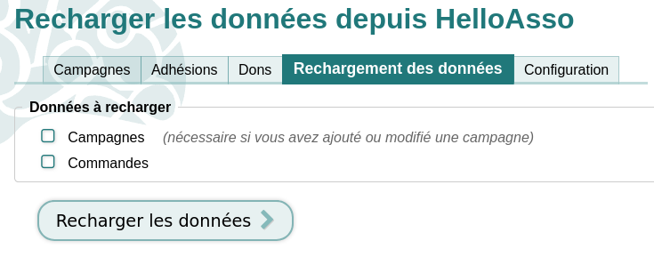
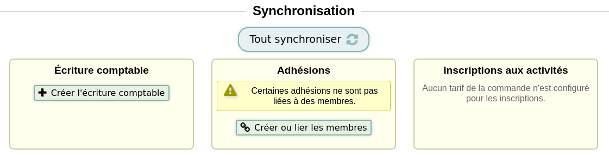

# n8n-nodes-paheko

> [!WARNING]  
> This project is experimental. Use it at your own risk — breaking changes may occur without prior notice.

This is an n8n community node. It lets you integrate [Paheko](https://paheko.cloud/) (a free association management software) in your n8n workflows.

Paheko is a free, open-source web application for managing associations, including membership, billing, subscriptions, accounting, and messaging.

[n8n](https://n8n.io/) is a [fair-code licensed](https://docs.n8n.io/reference/license/) workflow automation platform.

[Installation](#installation)  
[Nodes](#nodes)  
[Credentials](#credentials)  
[Compatibility](#compatibility)  
[Resources](#resources)  
[Version history](#version-history)  

## Installation

Follow the [installation guide](https://docs.n8n.io/integrations/community-nodes/installation/) in the n8n community nodes documentation.

## Nodes

### Paheko Bot

Automates interactions with the Paheko web interface. Unlike the REST API node, Paheko Bot logs in using a real Paheko user's email and password via the web UI, allowing it to perform actions that have no API endpoint. The bot maintains a session cookie to interact with the platform as if a human were using it.

**Capabilities:**

- **HelloAsso sync** — Synchronizes HelloAsso campaigns and orders into Paheko. Requires the HelloAsso plugin to be enabled in the Paheko instance.
  

- **Order sync** — Clicks the "Tout synchroniser" button on a specific HelloAsso membership order page, also requiring the HelloAsso plugin.
  

- **Send message** — Sends a message (email) from the Paheko messaging interface to a member, as the organization or as the bot user.

**Resources and operations:**

- **HelloAsso Sync** — `Sync`: Synchronize HelloAsso forms and orders
- **Order Sync** — `Sync`: Synchronize orders
- **Send Message** — `Send`: Send a message to a Paheko member

### Paheko REST API

Interact with the Paheko REST API for managing association data, accounting, and members.

**Operations:**

- **SQL** — `Execute SQL query`: Run a SQL SELECT query with configurable output format (JSON, CSV, ODS, XLSX)
- **Web** — `List web pages`, `Get web page`, `Get web page HTML`: Access the Paheko website pages
- **User Categories** — `List user categories`: Get member categories
- **Users** — `Get user`, `Create user`, `Update user`, `Delete user`, `Subscribe user`: Manage association members
- **Errors** — `Report error`, `Get error log`: Send and view error reports
- **Accounting** — `List accounting years`, `List accounting charts`, `Get chart accounts`, `Get year journal`, `Get account journal`: Access accounting data
- **Transactions** — `Get transaction`, `Create transaction`, `Update transaction`, `Get transaction entries`, `Create/update/delete transaction entries`, `Get/update/delete transaction users`, `Get/update/delete transaction subscriptions`: Manage journal entries and their linked data

**API routes coverage:**

| Category | Route | Method | Implemented | Operation |
|----------|-------|--------|:-----------:|-----------|
| **SQL** | `/api/sql` | POST | ✅ | Execute SQL |
| **Downloads** | `/api/download` | GET | ✅ | Download database |
| **Downloads** | `/api/download/files` | GET | ✅ | Download files ZIP |
| **Web** | `/api/web/list` | GET | ✅ | List web pages |
| **Web** | `/api/web/page/{PAGE_URI}` | GET | ✅ | Get web page |
| **Web** | `/api/web/html/{PAGE_URI}` | GET | ✅ | Get web page HTML |
| **Web** | `/api/web/attachment/{PAGE_URI}/{FILENAME}` | GET | ✅ | Get attachment |
| **Users** | `/api/user/categories` | GET | ✅ | List user categories |
| **Users** | `/api/user/category/{ID}.{FORMAT}` | GET | ✅ | Export category members |
| **Users** | `/api/user/new` | POST | ✅ | Create user |
| **Users** | `/api/user/{ID}` | GET | ✅ | Get user |
| **Users** | `/api/user/{ID}` | POST | ✅ | Update user |
| **Users** | `/api/user/{ID}` | DELETE | ✅ | Delete user |
| **Users** | `/api/user/{ID}/subscribe` | POST | ✅ | Subscribe user |
| **Users** | `/api/user/import` | PUT/POST | ✅ | Import members |
| **Users** | `/api/user/import/preview` | PUT/POST | ✅ | Preview import |
| **Services** | `/api/services/subscriptions/import` | PUT | ✅ | Import subscriptions |
| **Errors** | `/api/errors/report` | POST | ✅ | Report error |
| **Errors** | `/api/errors/log` | GET | ✅ | Get error log |
| **Accounting** | `/api/accounting/years` | GET | ✅ | List fiscal years |
| **Accounting** | `/api/accounting/charts` | GET | ✅ | List chart of accounts |
| **Accounting** | `/api/accounting/charts/{ID}/accounts` | GET | ✅ | Get chart accounts |
| **Accounting** | `/api/accounting/years/{ID}/journal` | GET | ✅ | Get year journal |
| **Accounting** | `/api/accounting/years/{ID}/export/{FORMAT}.{EXT}` | GET | ✅ | Export fiscal year |
| **Accounting** | `/api/accounting/years/{ID}/account/journal` | GET | ✅ | Get account journal |
| **Transaction** | `/api/accounting/transaction` | POST | ✅ | Create transaction |
| **Transaction** | `/api/accounting/transaction/{ID}` | GET | ✅ | Get transaction |
| **Transaction** | `/api/accounting/transaction/{ID}` | POST | ✅ | Update transaction |
| **Transaction** | `/api/accounting/transaction/{ID}/users` | GET | ✅ | Get transaction users |
| **Transaction** | `/api/accounting/transaction/{ID}/users` | POST | ✅ | Update transaction users |
| **Transaction** | `/api/accounting/transaction/{ID}/users` | DELETE | ✅ | Delete transaction users |
| **Transaction** | `/api/accounting/transaction/{ID}/transactions` | GET | ✅ | Get transaction entries |
| **Transaction** | `/api/accounting/transaction/{ID}/transactions` | POST | ✅ | Update transaction entries |
| **Transaction** | `/api/accounting/transaction/{ID}/transactions` | DELETE | ✅ | Delete transaction entries |
| **Transaction** | `/api/accounting/transaction/{ID}/subscriptions` | GET | ✅ | Get transaction subscriptions |
| **Transaction** | `/api/accounting/transaction/{ID}/subscriptions` | POST | ✅ | Update transaction subscriptions |
| **Transaction** | `/api/accounting/transaction/{ID}/subscriptions` | DELETE | ✅ | Delete transaction subscriptions |

## Credentials

This package provides two credential types:

### Paheko API

Used by the **Paheko Bot** node. Authenticates using a Paheko account session (email and password). The node handles the login and cookie management automatically.

**Required fields:**

- **Paheko Base URL**: Base URL of your Paheko instance (e.g., `https://your-instance.paheko.cloud`)
- **Email**: Paheko account email
- **Password**: Paheko account password

**Required permissions:**

The Paheko account used for the bot needs the following permissions to function correctly:

- **Ability to log in** — The account must be allowed to authenticate.
- **Members** — Either **Administration** (full access) or **Read & Write** (can add and modify members, but not delete them; can enroll members in activities; can send bulk messages). Note: to send messages as the organization (sender = Organization) via the Paheko Bot **Send Message** node, the bot must have the **Administration** level for member management. The **Read & Write** level is sufficient for all other bot operations but does not allow sending emails as the organization.
- **Accounting** — Read & Write (can create journal entries, but not modify or delete existing ones).

Required permissions : 

Recommended permissions :

### Paheko REST API

Used by the **Paheko REST API** node. Authenticates using the Paheko REST API credentials with Basic authentication.

**Required fields:**

- **Paheko Base URL**: Base URL of your Paheko instance (e.g., `https://your-instance.paheko.cloud`)
- **API Identifier**: API identifier
- **API Password**: API password

## Compatibility

- **n8n version**: Requires n8n v1.0+ (n8n Nodes API v1)
- **Node version**: Supports all Node.js versions supported by n8n
- No external runtime dependencies

## Resources

* [n8n community nodes documentation](https://docs.n8n.io/integrations/#community-nodes)
* [Paheko documentation](https://paheko.cloud)

## Version history

### 0.1.0

Initial release with two nodes:

- **Paheko Bot**: HelloAsso synchronization, order sync, and member messaging
- **Paheko REST API**: Full REST API coverage for users, accounting, transactions, web pages, and error reporting

